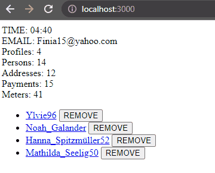

# Getting started

If you have just cloned this project, install all necessary dependencies:

### `npm install`

Then, the frontend can be started with the following command:

### `npm run dev`

And voilá, the frontend should now be up and running.

---

# Context

There is only one single component, called `App.tsx`. There is only a placeholder content in it. The entire content
should be replaced by your solution.

In the `.env` file, the environment variables are already configured according to the values defined
in the backend. Please use these in your coding challenge. The frontend part was created using `Vite`,
if you're unfamiliar with environment variable in `Vite`, they are accessed with the following syntax:

- `import.meta.env.ENV_VARIABLE_NAME`

Currently, there is only one variable defined, that points to the backend server to be started:

- `import.meta.env.VITE_USER_ACCOUNT_BACKEND_URL`

---

# Tasks

### Task 1 - Fetching data
Fetch the `UserAccount` data from the backend and display it. The display should include the following:

- The email of the user (this information should **always** be displayed, regardless of other tasks)

- How many `Profile`, `PaymentMethod`, `Person`, `Address` and `Meter` exist in the `UserAccount` (this information should **always** be displayed, regardless of other tasks).

- A display of the names of each profile present. For example, as a simple list, each element would be:
    - `Profile name 1`
    - `Profile name 2`
    - `Profile name 3`
    - ...

### Task 2 - Feedback for user
Display any sort of loader to show that data is currently being fetched. Pulsating dots, a spinner,
a sand glass rotating in 3D, anything goes.

### Task 3 - Deletion
Implement a CTA next (below, above, on the side, it is your choice on how to do it) to each profile name.
Clicking on that CTA should perform a POST request to remove the profile. Just like when fetching data, implement
any kind of feedback that indicates that a request is currently ongoing, until it finishes.

When the request successfully finishes, the new state should be immediately reflected in the view: the profile
in question should be removed from the list, together with everything related to it.

### Task 4 - Navigation
Each profile name implemented in the first task should become a link. Clicking on a profile's name link should go
to a page that displays further details about the profile. The details displayed must include at least:
 
- A list of persons belonging to the selected profile. Each element of the list must be the combination of the salutation,
first name and last name (for example, "Herr John Doe").

- A list of addresses belonging to the selected profile. Each element of the list must be the combination of the
postalCode and the address name (for example, "69123 - My House")

- A list of payment methods belonging to the selected profile. Each element of the list must be the name of the
payment method (for example, "My bank")

Each of these should also be links to their respective details views. Clicking on an entry of the person list should
navigate to a page that displays further details about the person. The details displayed must include at least the
salutation, **first name**, **last name**, **occupation**, **birthdate**, and an indicator if this person is a
**primary** element.

Clicking on an entry of the address list should navigate to a page that displays further details about the
address. The details displayed must include at least the **name**, **postal code**, **city**, **street**,
**house number**, and an indicator that shows which kind of **primary** address this element is (**mailing**,
**billing**, **shipping**).

Clicking on an entry of the payment methods list should navigate to a page that displays further details about the
payment method. The details displayed must include at least the **name**, **iban**, **bic**, and an indicator that
shows if this payment method is a **primary** element.

# Bonus tasks

### Task 1
Create a timer that measures seconds and milliseconds taken to retrieve the initial data. It should start as soon as
the request starts, and stops as soon as the request finishes. Below is an example, although completely unstyled:

   

      
   

### Task 2
We would love to see some styles!

If you believe that prototyping with an already-built library (bootstrap, bulma, tailwind, emotion, material-ui, etc...), then do make use of it.
However, we would definitely prefer to see your own custom styles.

---

# Important notes:

- Feel free to move, create, and update the frontend files as you wish. We already provide the proper types
  to be used (check the file `types.ts`), but you can create anything you consider as a facilitator. Fetching libraries,
  state management libraries, parsers, etc.

- That being said, do not take this as a chance to show off as many techs as possible. As long as there are no
  performance issues, we value code that is easily understandable and well organized, instead of overly complex
  optimizations, no matter what libraries you use or don't use!

- If you have any doubt regarding the tasks, the setup, etc., do contact us.
